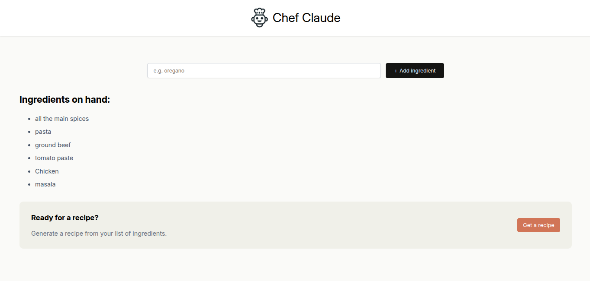

# Day 16 Log

- Practiced **conditional rendering** extensively and cleared all doubts.
- Worked on the **ChefClaude project**:
  - Implemented the **Ingredients** and **Recipe** section buttons.
  - Improved component interaction and layout responsiveness.
  
- Learned and practiced how to **pass state variables as props** into child components (state lifting).
- Got more confident with using `useState` and understanding how re-renders work in React.

### Mood:

Feeling more confident with React fundamentals, progress is steady and rewarding! I will start working on a Todolist app built using reactjs so im quite exicted to start and refining my react skills.

> *Logged on: April 29, 2025*