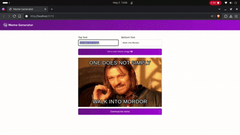

# Day 21 Log

- Finished my **Meme Generator** project!
- Added a **Download Meme** feature using `html2canvas`:
  - Captures the meme preview using DOM-to-canvas conversion.
  - Saves it as a downloadable PNG with a random background color.
- Deep dive into **React's `useEffect`**:
  - Understood why event listeners should be added inside `useEffect` with cleanup.
  - Learned that without `useEffect`, listeners are re-attached on every render, leading to memory leaks and unexpected behavior.
  - Practiced how to write a proper cleanup function to remove event listeners on unmount.

> *Logged on: May 5, 2025*