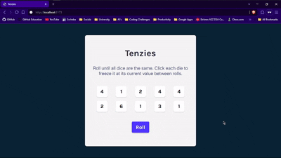

# Day 40 & 41 log

- Used `useState` to manage the dice array state.
- Generated 10 dice using `Math.ceil(Math.random() * 6)` with unique IDs via `nanoid`.
- Created `rollDices()` function:
  - Re-rolls only non-held dice.
  - Resets the game when player wins.
- Implemented `onHold()` function:
  - Toggles `isHeld` for the clicked die.
  - Used immutable updates with `map` and spread operator.
- Rendered Dice components dynamically using `map`.
- Managed roll count using `useRef` (`rollCounter`).
- Added visual feedback on win using `react-confetti`.
- Implemented score tracking with `localStorage`.
- Compared current roll count with previous best score.
- Updated score only if new score is better.
- Handled type conversion from `localStorage` (string → number).
- Stored previous score using `useRef`.

## Preview 

> *Logged on: May 24, 25 2025*