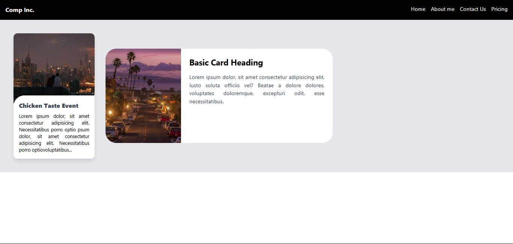

# Day 42 & 43 log

- Built the basic card layout using Tailwind CSS.
- Fixed image corner rounding issues using `-mt-*` and responsive utilities.
- Better understanding of **negative margin stacking** in Tailwind.
- Reinforced how **responsive flex/grid** behaviors adapt across breakpoints.
- Refactored the navbar for full responsiveness.
- Used `flex-col sm:flex-row` and spacing utilities for layout.
- How Tailwind handles **flex direction switching** with breakpoints.
- Small UX improvements like `hover:` and `cursor-pointer` make a big difference.

> *Logged on: May 26, 27 2025*

# Day 44 & 45 log

- Studied **Tailwind CSS documentation** in-depth.
- Learned about:
  - Utility classes – how they map to individual CSS properties.
  - Variants – such as `hover:`, `focus:`, `group-hover:`, etc.
  - Responsive breakpoints – `sm:`, `md:`, `lg:`, `xl:`, and how they affect layout/styling.
- Understood how Tailwind works **under the hood** (utility-first approach, class merging, and purging).
- Practiced creating **a responsive card component** using pure Tailwind classes.
- Built a **mini site** (fully responsive) using only Tailwind CSS.
- Created and organized my own **Tailwind CSS notes** for quick future reference.
- Tailwind’s responsive utilities are **easy to use and intuitive**, once you get the hang of mobile-first design.
- Tried forcing styles using `!important` via `!` prefix – helps with specificity issues.
- Customized colors and spacing using **arbitrary values** like `bg-[#666]` and `mt-[18px]`.

> *Logged on: May 28, 29 2025*

### Screenshots:

